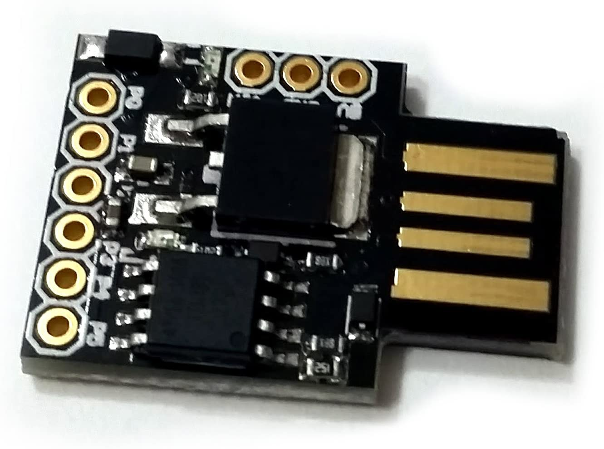
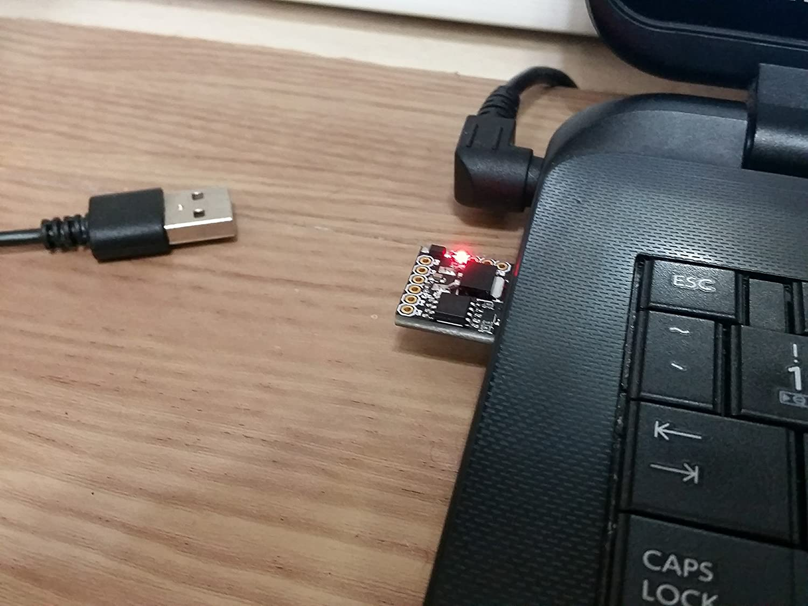

<!DOCTYPE html>
<html>
<head>
 
</head>

# eRCaGuy_ComputaPranksta_Support
Public support for my "Computa Pranksta" mouse jiggler device I sell on Amazon and elsewhere.

This device is a mouse jiggler. It keeps your computer awake. It can also be used to have some fun with your friends (please don't take it too far--it's meant to be used in good, friendly gest--not for any type of malicious purposes).

# Status:

It is functional and for sale! 

# [Buy on Amazon!](https://amzn.to/2ReBSuN)

 

 

new answers:

 
 
 
 
 
 
 

# License

Any material in this repository is bound by the open source MIT License, as specified in the [LICENSE](LICENSE) file herein, unless already bound by a more-restrictive license. The c

The device _hardware_ is based on the open source Digispark

(IN WORK)

----

Disclaimer required by Amazon:  
_We are a participant in the Amazon Services LLC Associates Program, an affiliate advertising program designed to provide a means for us to earn fees by linking to Amazon.com and affiliated sites._

</html>