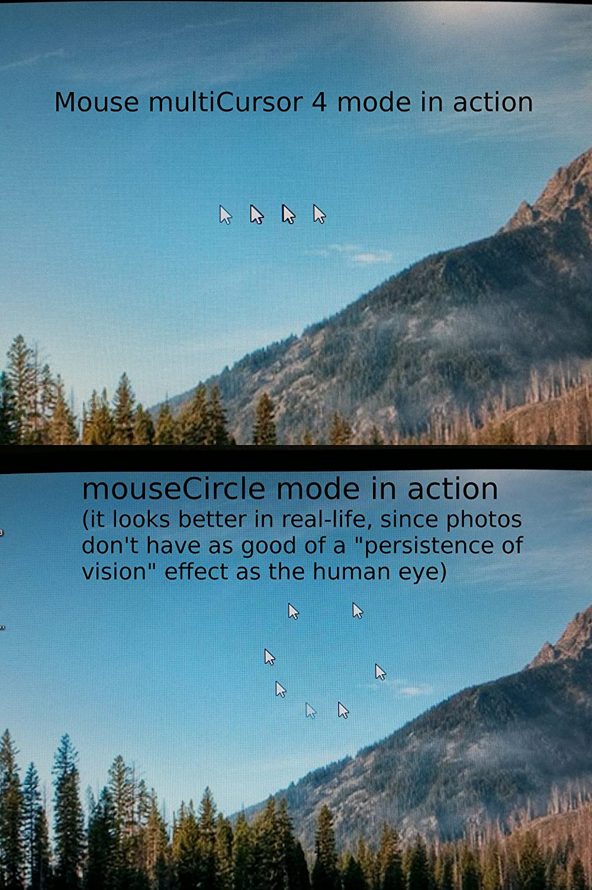
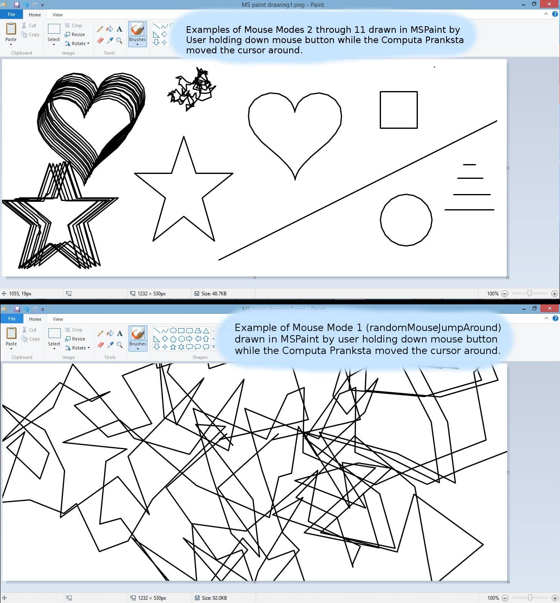
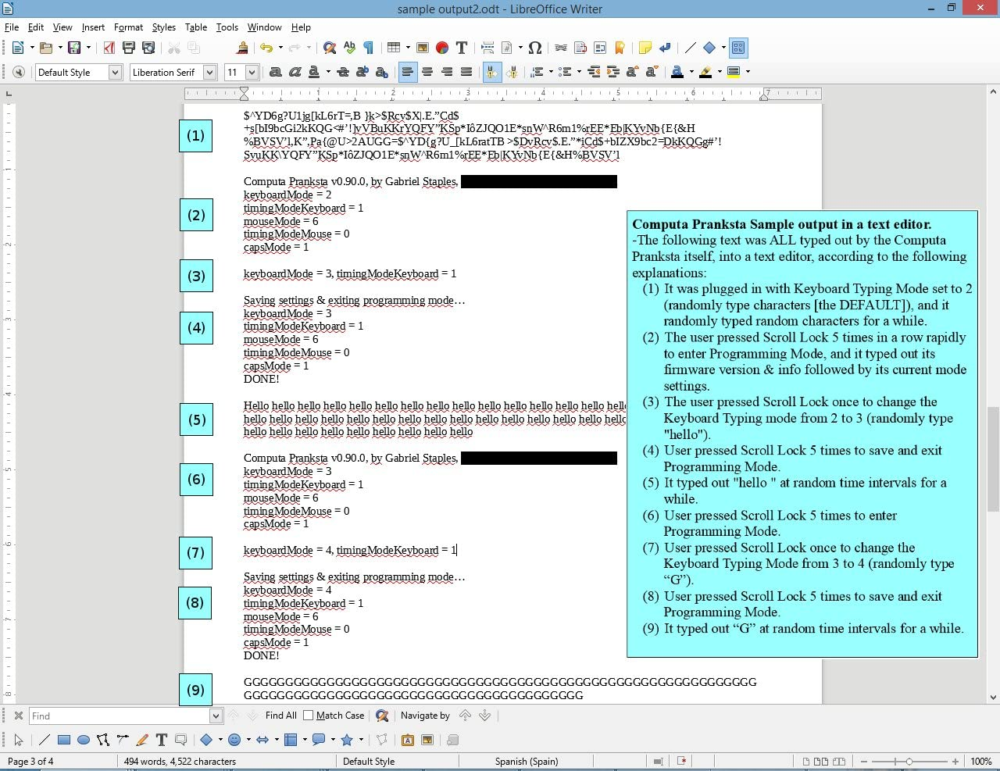
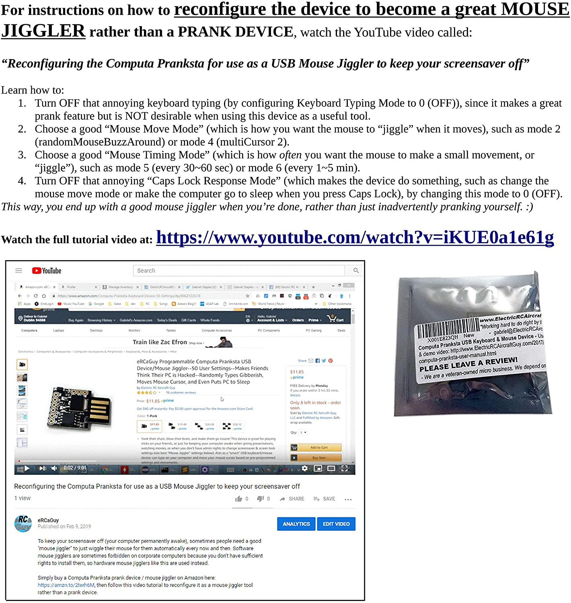
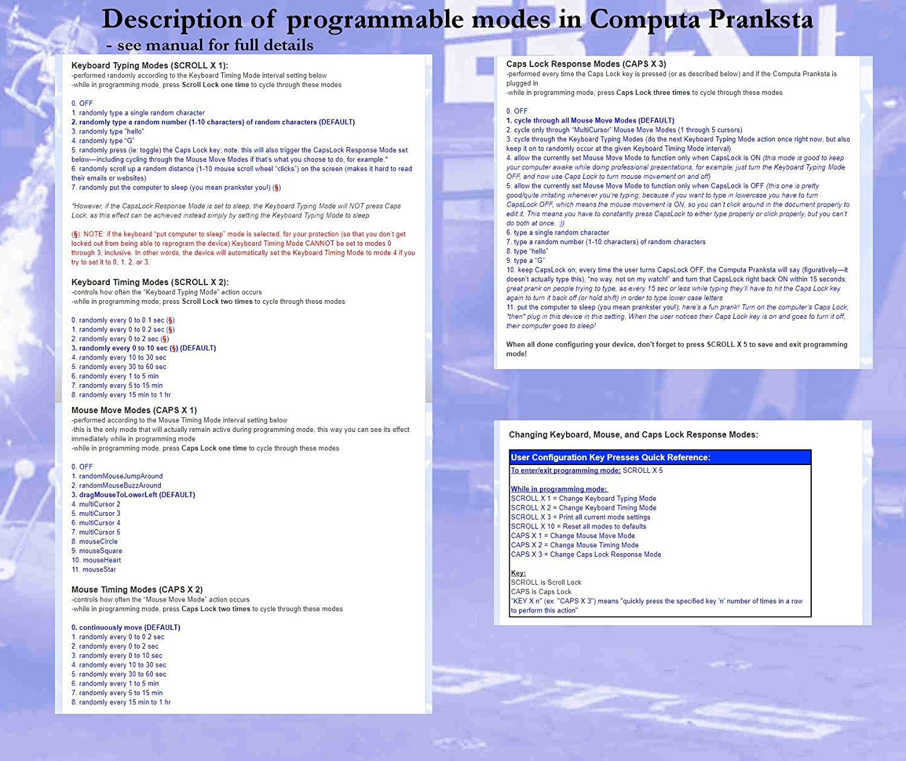
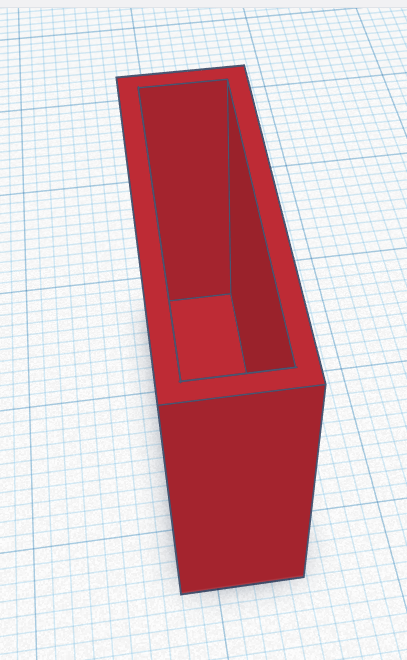
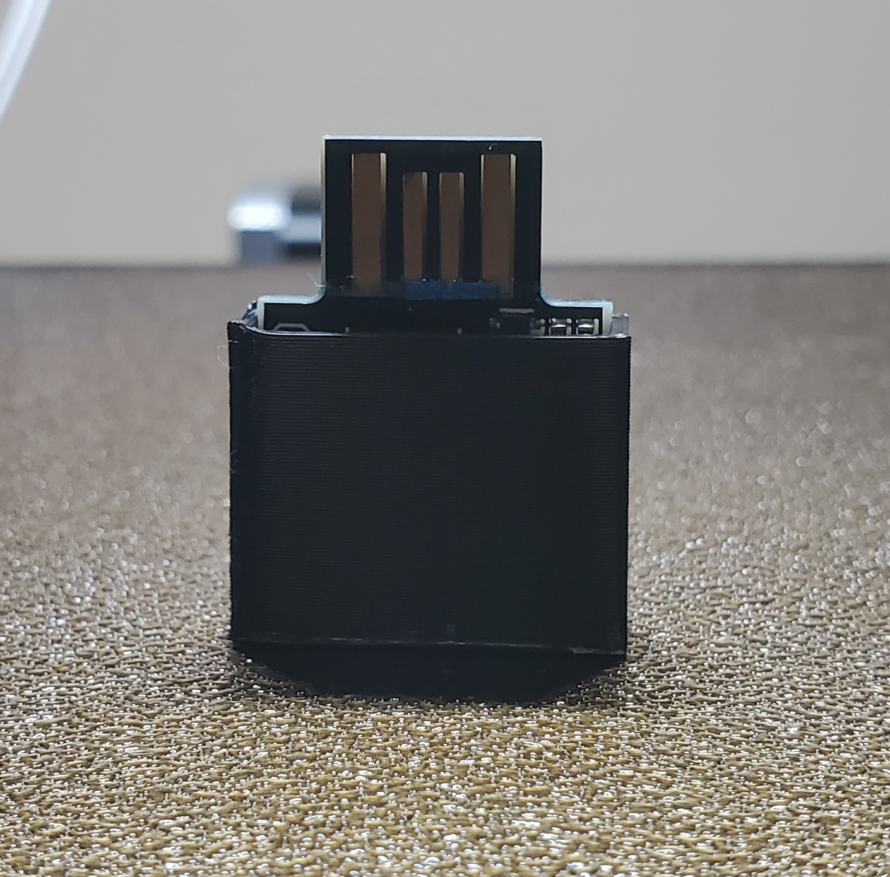

# eRCaGuy_ComputaPranksta_Support
Public support for my "Computa Pranksta" mouse jiggler device I [sell on Amazon](https://amzn.to/2ReBSuN) and elsewhere.

This device is a mouse jiggler. It keeps your computer awake. It can also be used to have some fun with your friends (please don't take it too far--it's meant to be used in good, friendly gest--not for any type of malicious purposes).

# Status

It is functional and for sale! 

# [Buy on Amazon here!](https://amzn.to/2ReBSuN)

**Product Images (click to enlarge):**

|                                               |                                               |                                               |
|-----------------------------------------------|-----------------------------------------------|-----------------------------------------------|
|  |  |  |
|  |  |  |

**Quick Reference Sheet (click to enlarge, then use `Ctrl` + `+` and `Ctrl` + `-` to zoom in and out in your browser, and arrow keys to scroll up/down and left/right):**

     

# Help Links & Support

1. Main **"user manual"** online: https://www.electricrcaircraftguy.com/2017/04/computa-pranksta-user-manual.html
1. **YouTube Videos**:
    1. [How to Use & Configure the Computa Pranksta USB Keyboard & Mouse Prank Device](https://www.youtube.com/watch?v=LjEPAu1H8Z0)
    1. [Reconfiguring the Computa Pranksta for use as a USB Mouse Jiggler to keep your screensaver off](https://www.youtube.com/watch?v=iKUE0a1e61g)

## Support

You can either:

1. Click the "user manual" link just above, and email me at the email address shown at the top of that page, OR:
1. (Recommended, if you're ok with your support being public to help others with the same question): sign in with a free GitHub account and click the ["Issues" tab](https://github.com/ElectricRCAircraftGuy/eRCaGuy_ComputaPranksta_Support/issues) at the top and create a "New issue". Note that this issue will be publicly visible by anyone. This also gives users a chance to help answer each others' questions.

# Wiki

There is a [public wiki for this project here](https://github.com/ElectricRCAircraftGuy/eRCaGuy_ComputaPranksta_Support/wiki), which is _editable by anybody._ If you'd like to contribute to the wiki or edit it, just sign in with a free GitHub account and edit the wiki directly.

# License

The license for all content in this repo not otherwise already bound by another license is:

Creative Commons Attribution-NonCommercial-ShareAlike 4.0 International (CC BY-NC-SA 4.0)

For terms, see:

1. License Deed (plain English terms): https://creativecommons.org/licenses/by-nc-sa/4.0/
2. Legal Code: https://creativecommons.org/licenses/by-nc-sa/4.0/legalcode

# CAD Files for a 3D-printed case

See the cad_files folder for downloads.

1. [cad_files/Thomas_Edgar](cad_files/Thomas_Edgar)

     
     

# Acknowledgements 

As is the case with most projects anyone does, I am standing on the shoulds of giants. Here are some giants who have come before me to make this technology possible. 

(IN WORK)

The device _hardware_ is based on the open source Digispark...

----

Disclaimer required by Amazon:  
_We are a participant in the Amazon Services LLC Associates Program, an affiliate advertising program designed to provide a means for us to earn fees by linking to Amazon.com and affiliated sites._
