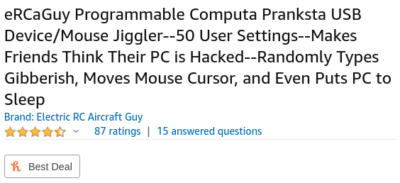

# eRCaGuy_ComputaPranksta_Support
Public support for my "Computa Pranksta" mouse jiggler device I [sell on Amazon](https://amzn.to/2ReBSuN) and elsewhere.

This device is a mouse jiggler. It keeps your computer awake. It can also be used to have some fun with your friends (please don't take it too far--it's meant to be used in good, friendly gest--not for any type of malicious purposes).

# Status

It is functional and for sale! 

# [Buy on Amazon here!](https://amzn.to/2ReBSuN)
<a href="https://amzn.to/2ReBSuN" title="Click to view on Amazon">
    

         
    

</a>

# Main Links:
1. **YouTube Getting Started Videos**:
    1. [How to Use & Configure the Computa Pranksta USB Keyboard & Mouse Prank Device](https://www.youtube.com/watch?v=LjEPAu1H8Z0)
    1. **[MOST COMMON REQUEST!] [Reconfiguring the Computa Pranksta for use as a USB Mouse Jiggler to keep your screensaver off](https://www.youtube.com/watch?v=iKUE0a1e61g)**
1. Main **"user manual"** online: https://www.electricrcaircraftguy.com/2017/04/computa-pranksta-user-manual.html

# Product Images 
(click an image to enlarge it)

|                                               |                                               |                                               |
|-----------------------------------------------|-----------------------------------------------|-----------------------------------------------|
|  |  |  |
|  |  |  |

# Quick Reference Sheet 
(click to enlarge, then use `Ctrl` + `+` and `Ctrl` + `-` to zoom in and out in your browser. To scroll up/down and left/right on the image, first click on it with your mouse, and then use your arrow keys)

     

# Support / Email / Submit an Issue here on GitHub

You can either:

1. Click the "user manual" link just above, and email me directly at the email address shown at the top of that page, OR:
1. (Recommended, if you're ok with your support being public to help others with the same question): sign in with a free GitHub account and click the ["Issues" tab](https://github.com/ElectricRCAircraftGuy/eRCaGuy_ComputaPranksta_Support/issues) at the top and create a "New issue". Note that this issue will be publicly visible by anyone. This also gives users a chance to help answer each others' questions.

# Wiki

There is a [public wiki for this project here](https://github.com/ElectricRCAircraftGuy/eRCaGuy_ComputaPranksta_Support/wiki), which is _editable by anybody._ If you'd like to contribute to the wiki or edit it, just sign in with a free GitHub account and edit the wiki directly.

# License

The license for all content in this repo not otherwise already bound by another license is:

Creative Commons Attribution-NonCommercial-ShareAlike 4.0 International (CC BY-NC-SA 4.0)

For terms, see:

1. License Deed (plain English terms): https://creativecommons.org/licenses/by-nc-sa/4.0/
2. Legal Code: https://creativecommons.org/licenses/by-nc-sa/4.0/legalcode

# CAD Files for a 3D-printed case

See the cad_files folder for downloads.

1. [cad_files/Thomas_Edgar](cad_files/Thomas_Edgar)

     
     

# Credits and Base Technologies 

As is the case with most projects anyone does, I am standing on the shoulds of giants. Here are some giants who have come before me to make this technology possible. 

The Computa Pranksta relies on the following technologies, in rough order from what I consider "highest level" to lowest level.

1. [Arduino](https://www.arduino.cc/): the Pranksta uses the Arduino ecosystem, including the IDE. Arduino is _amazing._ I'm a professional software developer today, because of Arduino. Thank you Massimo Banzi, Arduino, and others!
1. [Digispark](http://digistump.com/products/1) - the device _hardware_ is based on the open source Digispark, by DigiStump. DigiStump is awesome. So glad they exist. [They were kickstarted](https://www.kickstarter.com/projects/digistump/digispark-the-tiny-arduino-enabled-usb-dev-board), you know, in late 2012!
    1. [Here's the hardware schematic from Digispark](DigisparkSchematic.pdf)
    1. Online source:
        1. [DigiSpark pg](http://digistump.com/products/1) --> Resources --> "Schematics"
        1. [direct link](https://s3.amazonaws.com/digistump-resources/files/97a1bb28_DigisparkSchematic.pdf)
    1. Hardware license: [CC-BY-SA 3.0](https://creativecommons.org/licenses/by-sa/3.0/)
    1. Note: it appears to me that diode D3 shown in the DigiSpark schematic is backwards, but I haven't confirmed with them to be sure.
1. Adafruit USB Keyboard and Mouse Library: ["TrinketHidCombo", with my changes](https://github.com/ElectricRCAircraftGuy/Adafruit-Trinket-USB/tree/master/TrinketHidCombo)
    1. License: LGPL 3 or later
1. [Micronucleus](https://github.com/micronucleus/micronucleus): this is the bootloader which allows me to upload my custom firmware which makes the Computa Pranksta a Computa Pranksta
    1. License for the bootloader only, not what has been uploaded by it: GPLv2
1. [V-USB](https://www.obdev.at/products/vusb/index.html): the software implementation of low-speed USB which allows the USB-incapable microcontroller which runs this device to bit-bang out the USB protocol. This is amazing. Micronucleus requires this. This is what makes Micronucleus able to communicate over USB, and it's what powers the underlying USB protocol to allow the Pranksta to become a USB HID keyboard and mouse combo.
1. [AVR Libc](https://www.nongnu.org/avr-libc/): the C library implementation for the microcontroller in use; a key component to make it programmable.
1. [gcc](https://gcc.gnu.org/): the compiler which turns C and C++ code into machine code which can be run by the computer processor inside the Computa Pranksta. This is a beast. Perhaps *100 man years* of work have gone into its creation.

Also:

1. [Linux Ubuntu](https://ubuntu.com/): the free and open source, _and_ no cost (`free != no_cost`!) operating system I now use for all of my development and programming of the devices before I mail them out to Amazon for fulfillment. I used to use Windows for all development, but have slowly gotten rid of Windows. Today, all the computers in my house run Linux Ubuntu, including the ones used by my 3 and 7 year old kids, and my wife's computer too. My wife flashes all firmware from a Linux computer using micronucleus at the command-line. Thank you wife, and Linux.

----

Disclaimer required by Amazon:  
_We are a participant in the Amazon Services LLC Associates Program, an affiliate advertising program designed to provide a means for us to earn fees by linking to Amazon.com and affiliated sites._

