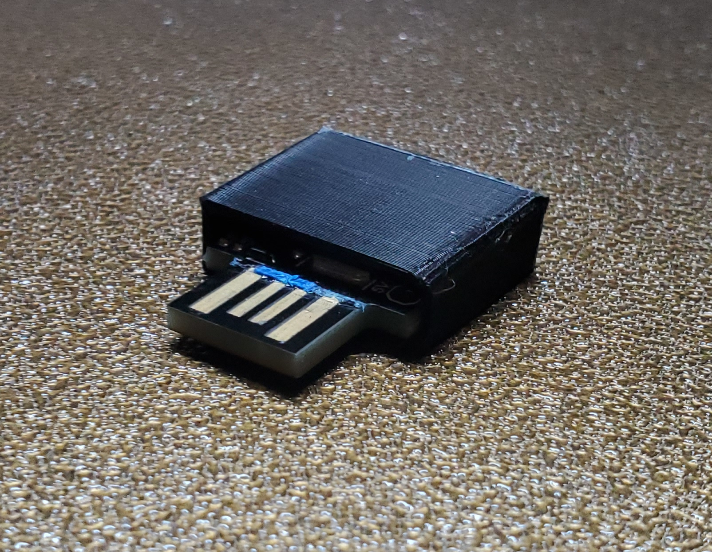

5 Aug. 2020

This 3D printed case STL file is provided for free by:

Thomas Edgar  
Basin Design Service, LLC  
http://www.basindesign.com/

Thank you!

# License:

This particular STL file is released under the [CC BY 4.0 license](https://creativecommons.org/licenses/by/4.0/). You can have your high-schooler mass-3D-print these cases to sell them to raise money for college for all I care. Just link back to 1) [my product sales page on Amazon](https://amzn.to/2ReBSuN) and 2) to [this support page](https://github.com/ElectricRCAircraftGuy/eRCaGuy_ComputaPranksta_Support) is all I ask. If you ask me to link to your sales page for the cases you print and sell too I'll probably do that as well.

**On that note: I'm looking for a reliable person to ship my products for me so I don't have to deal with Amazon losing my inventory anymore. If you have a kid looking to make a little spending money, feel free to contact me. I'm trying to consider options other than Fulfilled-by-Amazon, because although as a _buyer_ I love them, as a _seller_ I can't stand them. They lose a large percent of what I ship to them, and their customer service to sellers is the worst in the world. They are horrible to work with.**

\~ Gabriel Staples

# Instructions:

Print it. Shove the Computa Pranksta into it. It's just a friction fit. No need to glue it at all; works great as-is! Done.  

Note: if you do want to glue it anyway, I recommend hot glue. It's inert, non-conductive, and safe for electronics. 

**STL 3D CAD file: [PrankstaCase.stl](PrankstaCase.stl)** <=== DOWNLOAD ME! ====

# Images:

     
     

     
     
     

